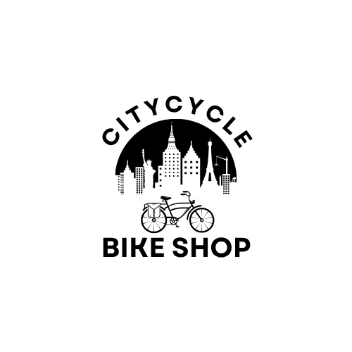

<p align="center">
  
</p>

<h1 align="center">CityCycle - Bike Sharing Platform</h1>

<p align="center">
  A modern bicycle sharing system built with Laravel for managing bike inventory, reservations, and maintenance across urban hubs.
</p>

<p align="center">
  <a href="https://laravel.com" target="_blank"></a>
  <a href="https://php.net" target="_blank"></a>
  <a href="https://mariadb.org" target="_blank"></a>
  <a href="https://tailwindcss.com" target="_blank"></a>
  <a href="https://vuejs.org" target="_blank"></a>
</p>

<p align="center">
  <a href="#features">Features</a> •
  <a href="#screenshots">Screenshots</a> •
  <a href="#tech-stack">Tech Stack</a> •
  <a href="#installation">Installation</a> •
  <a href="#api-endpoints">API</a> •
  <a href="#project-structure">Structure</a> •
  <a href="#contributing">Contributing</a> •
  <a href="#license">License</a>
</p>

---

## 🌟 Features

### 🚲 Bike Management
- **Real-time bike availability tracking** - Monitor bike status across all hubs in real-time
- **Unique bike identifiers** - QR code support for easy bike identification and tracking
- **Maintenance status monitoring** - Track repair needs and service history
- **Bike transfer between hubs** - Seamless bike redistribution across locations

### 📍 Hub Operations
- **Multi-hub inventory management** - Centralized control of bikes across multiple locations
- **Capacity monitoring** - Real-time tracking of hub capacity and availability
- **Geographic hub locations** - GPS-enabled hub mapping and location services
- **Availability heatmaps** - Visual representation of bike availability patterns

### 📅 Reservation System
- **User bike reservations** - Allow users to reserve bikes in advance
- **Time-based availability** - Dynamic scheduling with time slot management
- **Reservation history** - Complete booking history for users and administrators
- **Cancellation workflow** - Flexible cancellation process with automated notifications

### 🔧 Maintenance Tracking
- **Service request creation** - Easy reporting system for maintenance issues
- **Repair status updates** - Real-time tracking of maintenance progress
- **Inspection scheduling** - Automated scheduling for routine bike inspections
- **Maintenance staff dashboard** - Dedicated interface for maintenance team operations

### 👤 User Experience
- **Responsive web interface** - Optimized for all device sizes and screen types
- **Mobile-friendly design** - Native-like experience on mobile devices
- **User account management** - Comprehensive profile and preference management
- **Reservation notifications** - Real-time alerts and booking confirmations

---

## 📸 Screenshots

| Hub Overview | Bike Reservation | Maintenance Dashboard |
|-------------|-----------------|----------------------|
|  |  |  |

---

## 🛠 Tech Stack

### Frontend
- **Tailwind CSS** - Modern utility-first CSS framework for rapid UI development
- **Vite** - Next-generation frontend tooling for fast builds and hot reloading
- **Vue.js** - Progressive JavaScript framework for reactive components
- **Alpine.js** - Minimal frontend framework for enhanced interactivity

### Backend
- **Laravel 10** - Robust PHP web framework with elegant syntax
- **Eloquent ORM** - Intuitive database abstraction layer
- **Sanctum** - Laravel's lightweight API authentication system

### Database & Caching
- **MariaDB** - High-performance relational database system
- **Redis** - In-memory data structure store for caching and queues (optional)

### DevOps & Deployment
- **Docker** - Containerization for consistent development environments
- **GitHub Actions** - Automated CI/CD pipeline for testing and deployment

---

## 🚀 Installation

### Prerequisites
Before you begin, ensure you have the following installed:
- **PHP 8.2+** with required extensions
- **Composer 2.0+** for PHP dependency management
- **MariaDB 10.6+** or MySQL 8.0+
- **Node.js 16+** with npm for frontend dependencies

### Quick Setup

1. **Clone the repository**
   ```bash
   git clone https://github.com/TlokotseSM/citycycle.git
   cd citycycle
   ```

2. **Install backend dependencies**
   ```bash
   composer install
   ```

3. **Install frontend dependencies**
   ```bash
   npm install
   ```

4. **Configure environment**
   ```bash
   cp .env.example .env
   php artisan key:generate
   ```

5. **Update database configuration in `.env`**
   ```env
   DB_CONNECTION=mysql
   DB_HOST=127.0.0.1
   DB_PORT=3306
   DB_DATABASE=citycycle
   DB_USERNAME=root
   DB_PASSWORD=your_password
   ```

6. **Run database migrations and seeders**
   ```bash
   php artisan migrate --seed
   ```

7. **Build frontend assets**
   ```bash
   npm run build
   ```

8. **Start the development server**
   ```bash
   php artisan serve
   ```

9. **Access the application**
   Open your browser and navigate to: `http://localhost:8000`

### Docker Setup (Alternative)

For a containerized setup:

```bash
# Clone and navigate to project
git clone https://github.com/yourusername/citycycle.git
cd citycycle

# Start with Docker Compose
docker-compose up -d

# Run migrations inside container
docker-compose exec app php artisan migrate --seed
```

---

## 🔌 API Endpoints

### Bikes Management
- `GET /api/bikes` - Retrieve list of all bikes with status and location
- `GET /api/bikes/{id}` - Get detailed information for a specific bike
- `GET /api/hubs/{id}/bikes` - List all bikes currently at a specific hub
- `POST /api/bikes` - Add a new bike to the system
- `PUT /api/bikes/{id}` - Update bike information
- `DELETE /api/bikes/{id}` - Remove bike from system

### Reservations
- `POST /api/reservations` - Create a new bike reservation
- `GET /api/users/{id}/reservations` - Get all reservations for a specific user
- `GET /api/reservations/{id}` - Get details of a specific reservation
- `DELETE /api/reservations/{id}` - Cancel an existing reservation
- `PUT /api/reservations/{id}` - Modify reservation details

### Maintenance
- `POST /api/maintenance` - Create a new maintenance log entry
- `PATCH /api/maintenance/{id}` - Update maintenance status and notes
- `GET /api/maintenance/due` - List bikes due for scheduled inspection
- `GET /api/maintenance` - Get all maintenance records with filtering options
- `GET /api/maintenance/{id}` - Get specific maintenance record details

### Hubs
- `GET /api/hubs` - List all bike hubs with availability counts
- `GET /api/hubs/{id}` - Get detailed hub information including capacity
- `POST /api/hubs` - Add a new hub location
- `PUT /api/hubs/{id}` - Update hub information

---

## 📂 Project Structure

```
app/
├── Models/                    # Database models and relationships
│   ├── Bike.php              # Bike model with status and location tracking
│   ├── Hub.php               # Hub model with capacity management
│   ├── Reservation.php       # Reservation model with time constraints
│   ├── MaintenanceLog.php    # Maintenance tracking model
│   └── User.php              # User model with authentication
├── Http/
│   ├── Controllers/          # Application logic and request handling
│   │   ├── BikeController.php
│   │   ├── HubController.php
│   │   ├── ReservationController.php
│   │   └── MaintenanceController.php
│   ├── Requests/             # Form validation classes
│   ├── Middleware/           # Custom middleware
│   └── Resources/            # API response transformers
├── Services/                 # Business logic services
├── Jobs/                     # Background job classes
└── Console/                  # Artisan commands

database/
├── factories/                # Test data factories for seeding
├── migrations/               # Database schema definitions
│   ├── create_bikes_table.php
│   ├── create_hubs_table.php
│   ├── create_reservations_table.php
│   └── create_maintenance_logs_table.php
└── seeders/                  # Database seeders for initial data

resources/
├── js/                       # JavaScript assets and components
│   ├── app.js               # Main application entry point
│   └── components/          # Vue.js components
├── css/                      # Stylesheets and Tailwind config
│   └── app.css
└── views/                    # Blade templates
    ├── layouts/             # Layout templates
    ├── bikes/               # Bike-related views
    ├── hubs/                # Hub management views
    └── dashboard/           # Admin dashboard views

routes/
├── web.php                   # Web application routes
├── api.php                   # RESTful API routes
└── console.php              # Artisan console routes

tests/
├── Feature/                  # Feature tests
├── Unit/                     # Unit tests
└── TestCase.php             # Base test class

config/                       # Configuration files
public/                       # Public assets and entry point
storage/                      # Application storage
vendor/                       # Composer dependencies
```

---

## 🧪 Testing

Run the test suite to ensure everything is working correctly:

```bash
# Run all tests
php artisan test

# Run specific test suite
php artisan test --testsuite=Feature

# Run tests with coverage
php artisan test --coverage
```

---

## 🚀 Deployment

### Production Setup

1. **Server Requirements**
   - PHP 8.2+ with required extensions
   - Web server (Apache/Nginx)
   - MariaDB/MySQL database
   - SSL certificate for HTTPS

2. **Environment Configuration**
   ```bash
   # Set production environment
   APP_ENV=production
   APP_DEBUG=false
   APP_URL=https://your-domain.com
   
   # Configure database
   DB_HOST=your-db-host
   DB_DATABASE=citycycle_production
   DB_USERNAME=production_user
   DB_PASSWORD=secure_password
   ```

3. **Deployment Commands**
   ```bash
   # Install production dependencies
   composer install --optimize-autoloader --no-dev
   
   # Build production assets
   npm run production
   
   # Run migrations
   php artisan migrate --force
   
   # Cache configuration
   php artisan config:cache
   php artisan route:cache
   php artisan view:cache
   ```

---

## 🤝 Contributing

We welcome contributions to CityCycle! Here's how you can help:

### Getting Started

1. **Fork the project** on GitHub
2. **Clone your fork** locally
   ```bash
   git clone https://github.com/TlokotseSM/citycycle.git
   ```
3. **Create your feature branch**
   ```bash
   git checkout -b feature/AmazingFeature
   ```

### Development Guidelines

- Follow PSR-12 coding standards for PHP
- Write meaningful commit messages
- Add tests for new functionality
- Update documentation as needed
- Ensure all tests pass before submitting

### Submitting Changes

1. **Commit your changes**
   ```bash
   git commit -m 'Add some AmazingFeature'
   ```
2. **Push to your branch**
   ```bash
   git push origin feature/AmazingFeature
   ```
3. **Open a Pull Request** with a clear description of your changes

### Code of Conduct

Please note that this project is released with a Contributor Code of Conduct. By participating in this project you agree to abide by its terms.

---

## 📄 License

This project is distributed under the MIT License. See `LICENSE` file for more information.

### MIT License Summary
- ✅ Commercial use
- ✅ Modification
- ✅ Distribution
- ✅ Private use
- ❌ Liability
- ❌ Warranty

---

## 📞 Support & Community

- **Documentation**: [Wiki](https://laravel.com/)
- **Issues**: [GitHub Issues](https://github.com/TlokotseSM/citycycle/issues)
- **Discussions**: [GitHub Discussions](https://github.com/TlokotseSM/citycycle/discussions)
- **Live Demo**: [CityCycle Demo](https://github.com/TlokotseSM/citycycle)

---

<p align="center">
  <strong>Made with ❤️ for sustainable urban mobility</strong>
</p>

<p align="center">
  <a href="https://github.com/yourusername/citycycle">GitHub</a> • 
  <a href="https://github.com/TlokotseSM/citycycle">Live Demo</a> • 
  <a href="https://laravel.com/">Documentation</a>
</p>
